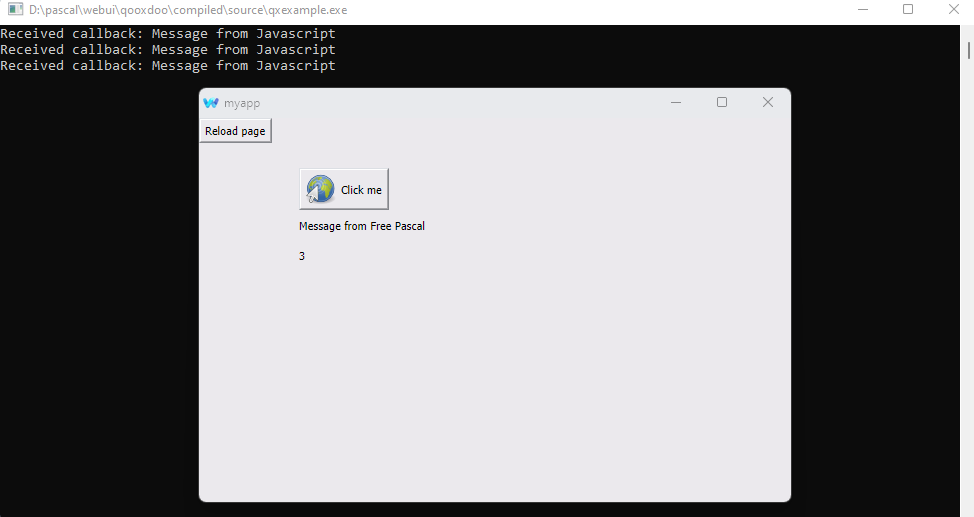

**qxexample** is an example of a simple console application with two-way binding.

if compiled with `-WG` flag, no console is shown, but `writeln` and `readln` are not possible, you will get `File not open` errors, so comment `writeln` line before compilation.

[WebUI dynamically loadable library](https://github.com/webui-dev/webui/releases/) and [Free Pascal wraper unit](https://github.com/webui-dev/pascal-webui/tree/main/src) must be in its properly places.

Don’t forget that the library is x64, so your application must be compiled as a 64-bit one. 

[Qooxdoo](https://github.com/qooxdoo/qooxdoo) universal JavaScript framework is used to generate the interface in the browser.

